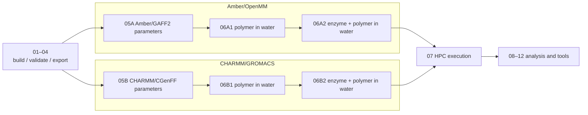

# Tutorial Notebooks

## Design goal

iPHASimulator v2 serves two purposes:

1. **A package** that builds PHA oligomers with RDKit and prepares molecular dynamics (MD) systems from them.
2. **The author's research**: MD of enzyme + PHA systems.

The notebooks follow one shared build stage (01–04), then split into two force-field
routes. The routes are kept separate: each uses one consistent force-field family from
polymer to protein to water and ions, so parameters from the two families are never mixed.

## The two routes

| | Amber/OpenMM | CHARMM/GROMACS |
| --- | --- | --- |
| Polymer | GAFF2, ABCG2 charges by default | CGenFF via CHARMM-GUI Ligand Reader & Modeler |
| Protein | ff19SB | CHARMM36m |
| Water / ions | OPC (with the ion parameters loaded by `leaprc.water.opc`) | CHARMM TIP3P + SOD/CLA |
| Engine | OpenMM | GROMACS |
| Parameters | `05A_amber_gaff2_parameters.ipynb` | `05B_charmm_cgenff_parameters.ipynb` |
| Polymer in water | `06A1_amber_openmm_polymer_in_water.ipynb` | `06B1_charmm_gromacs_polymer_in_water.ipynb` |
| Enzyme + polymer in water | `06A2_amber_openmm_enzyme_polymer_in_water.ipynb` | `06B2_charmm_gromacs_enzyme_polymer_in_water.ipynb` |
| Quick check without solvent | §0 of 06A1 | §0 of 06B1 |
| MD protocol | 06A1 = 06B1 (polymer benchmark); 06A2 = 06B2 (enzyme runs). Non-bonded settings follow each force field. | |
| HPC | `07_hpc_execution.ipynb`, OpenMM section | `07_hpc_execution.ipynb`, GROMACS section |

The enzyme–PHA production simulations (GK13/ANC45 × P3HO_4/P3HB_4) used the **CHARMM/GROMACS** route.
Their input structures were iPHASimulator's R-configured SDF/PDB files (for example
`PHB4_R.sdf`); CGenFF assigned all atom types, charges and parameters, so no GAFF2
charges enter them.

## Run order

Shared build stage:

1. `01_build_pha_oligomer.ipynb`: build PHA oligomers from the built-in monomer definitions.
2. `02_design_custom_pha.ipynb`: select or define a custom PHA target.
3. `03_validate_structures.ipynb`: validate generated oligomers and inspect structures.
4. `04_export_structures.ipynb`: export validated oligomers to SDF/PDB.

Amber/OpenMM:

5. `05A_amber_gaff2_parameters.ipynb`: AmberTools GAFF2 parameters (ABCG2 charges by default).
6. `06A1_amber_openmm_polymer_in_water.ipynb`: the GAFF2 polymer in OPC water (tleap), with staged OpenMM run files and the polymer benchmark protocol. §0 is an optional check without solvent.
7. `06A2_amber_openmm_enzyme_polymer_in_water.ipynb`: enzyme + polymer in OPC water from the same docked complex PDB as 06B2 (ff19SB + GAFF2, tleap), with the enzyme-run protocol.

CHARMM/GROMACS:

8. `05B_charmm_cgenff_parameters.ipynb`: CGenFF parameters through CHARMM-GUI Ligand Reader & Modeler and the Solution Builder handoff.
9. `06B1_charmm_gromacs_polymer_in_water.ipynb`: the CGenFF polymer in CHARMM TIP3P water with SOD/CLA, built locally from a Ligand Reader download with the same layout and protocol as the polymer-only benchmark (CHARMM non-bonded settings). §0 is an optional check without solvent.
10. `06B2_charmm_gromacs_enzyme_polymer_in_water.ipynb`: prepare and validate a CHARMM-GUI Solution Builder GROMACS package for enzyme + polymer in water, as used for the enzyme–PHA runs.

Execution and analysis:

11. `07_hpc_execution.ipynb`: HPC execution, SLURM submission, restart continuation, benchmarking and performance tuning; OpenMM and GROMACS sections.
12. `08_trajectory_preprocessing.ipynb`: GROMACS trajectory preprocessing: PBC reconstruction, centering with reusable `[ center ]` index groups, compact wrapping, optional fitting and representative frames.
13. `09_solvated_polymer_analysis.ipynb`: Rg, end-to-end distance and SASA of a solvated polymer from the centered trajectory.
14. `10_polymer_benchmark_batch.ipynb`: launcher and progress checker for the six-system polymer-only benchmark.
15. `11_enzyme_docking_setup.ipynb`: prepares PHA oligomer PDB inputs and job notes for manual HADDOCK docking.
16. `12_enzyme_polymer_analysis.ipynb`: stability diagnostics for one enzyme–polymer GROMACS production run (total energy, protein backbone RMSD, polymer RMSD relative to the protein).

The example data in 08/09 (P3HB_4_01) and the six benchmark systems in 10 were
parameterised with GAFF2/AM1-BCC and solvated in GROMACS with CHARMM-style
TIP3P/SOD/CLA.

## Conventions

These tutorials are written for users who may not be computational specialists.
They explain what each step means and keep editable input cells small.

Reusable Python logic belongs in `src/iphasimulator`. Notebook cells should guide
the workflow, not duplicate chemistry or simulation code.
