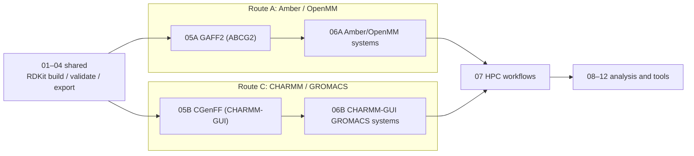

# Tutorial Notebooks

## Design goal

iPHASimulator v2 serves two purposes:

1. **A package** that builds PHA oligomers with RDKit and prepares molecular dynamics (MD) systems from them.
2. **The author's research**: MD of enzyme + PHA systems.

The notebooks follow one shared build stage (01–04), then split into two force-field
routes. The routes are kept separate: each uses one consistent force-field family from
polymer to protein to water and ions, so parameters from the two families are never mixed.

## The two routes

| | Route A: Amber family ("Option 1") | Route C: CHARMM family ("Option 2") |
| --- | --- | --- |
| Polymer | GAFF2, ABCG2 charges by default | CGenFF via CHARMM-GUI Ligand Reader & Modeler |
| Protein | ff19SB | CHARMM36m |
| Water / ions | OPC (with the ion parameters loaded by `leaprc.water.opc`) | CHARMM TIP3P + SOD/CLA |
| Engine | OpenMM | GROMACS |
| Parameters | `05A_amber_gaff2_parameterisation.ipynb` | `05B_charmm_cgenff_parameterisation.ipynb` |
| Systems | `06A_amber_openmm_system.ipynb` | `06B_charmm_gromacs_system.ipynb` (planned) |
| HPC | `07_hpc_workflows.ipynb`, Route A section | `07_hpc_workflows.ipynb`, Route C section |

The enzyme–PHA production simulations (GK13/ANC45 × P3HO_4/P3HB_4) used **Route C**.
Their input structures were iPHASimulator's R-configured SDF/PDB files (for example
`PHB4_R.sdf`); CGenFF assigned all atom types, charges and parameters, so no GAFF2
charges enter them.

## Notebooks

Shared build stage:

1. `01_examples_pha_oligomers.ipynb`: built-in PHA oligomer generation examples.
2. `02_design_polymer_for_user_request.ipynb`: select or define a PHA target.
3. `03_validate_and_visualize.ipynb`: validate generated oligomers and inspect structures.
4. `04_export_structures.ipynb`: export validated oligomers to SDF/PDB.

Route A (Amber / OpenMM):

5. `05A_amber_gaff2_parameterisation.ipynb`: AmberTools GAFF2 parameterisation (ABCG2 charges by default).
6. `06A_amber_openmm_system.ipynb`: Route A systems. §1 dry polymer check (available); §2 polymer in water and §3 polymer + protein (to come).

Route C (CHARMM / GROMACS):

7. `05B_charmm_cgenff_parameterisation.ipynb`: CGenFF parameters through CHARMM-GUI Ligand Reader & Modeler and the Solution Builder handoff.
8. `06B_charmm_gromacs_system.ipynb` (planned): Route C systems. §1 dry polymer check, §2 polymer in water, §3 polymer + protein, built from CHARMM-GUI GROMACS packages.

Execution and analysis:

9. `07_hpc_workflows.ipynb`: HPC execution, SLURM submission, restart continuation, benchmarking and performance tuning; Route A (OpenMM) and Route C (GROMACS) sections.
10. `08_trajectory_preprocessing.ipynb`: GROMACS trajectory analysis (Route C; example data from the archived hybrid route). PBC reconstruction, centering with reusable `[ center ]` index groups, compact wrapping, optional fitting and representative frames.
11. `09_basic_polymer_analysis.ipynb`: GROMACS trajectory analysis (Route C; example data from the archived hybrid route). Rg, end-to-end distance and SASA from the centered trajectory.
12. `10_batch_md_benchmark.ipynb`: launcher and progress checker for the six-system polymer-only benchmark, which uses the archived hybrid route.
13. `11_PHA_Enzyme_Docking.ipynb`: prepares PHA oligomer PDB inputs and job notes for manual HADDOCK docking.
14. `12_enzyme_polymer_stable_analysis.ipynb`: stability diagnostics for one enzyme–polymer GROMACS production run (total energy, protein backbone RMSD, polymer RMSD relative to the protein).

## Archive

[`archive/`](archive/README.md) keeps the old 06B, 06C and 06D notebooks. They form a
hybrid GAFF2 → GROMACS route with CHARMM-style TIP3P/SOD/CLA, which was used for the
six polymer-only benchmark systems (notebook 10, AM1-BCC charges) and the P3HB_4_01
example trajectory analysed in 08/09. They are kept for provenance and superseded by
Routes A and C.

## Conventions

These tutorials are written for users who may not be computational specialists.
They explain what each step means and keep editable input cells small.

Reusable Python logic belongs in `src/iphasimulator`. Notebook cells should guide
the workflow, not duplicate chemistry or simulation code.
