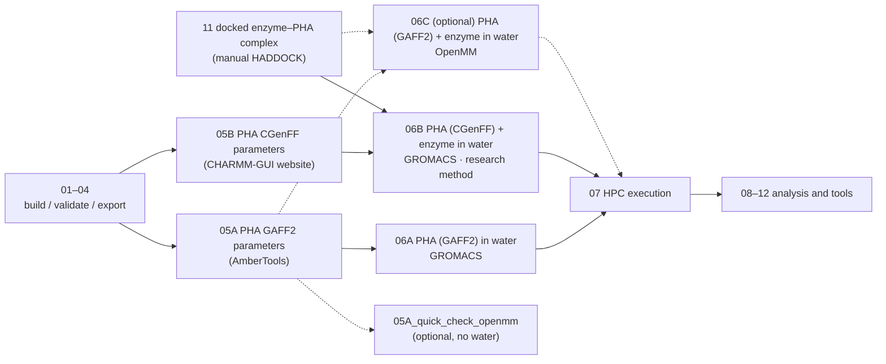

# Tutorial Notebooks

## Design goal

iPHASimulator v2 serves two purposes:

1. **A package** that builds PHA oligomers with RDKit and prepares molecular dynamics (MD) systems from them.
2. **The author's research**: MD of enzyme + PHA systems.

## How to use these notebooks

Review execution cells before Run All. The current 05A `RUN_GAFF2` is **True**.
10 performs the selected system’s preparation, solvation and minimisation, and
submits on a cluster if `sbatch` is available and no submission is recorded.
06A/06C and the quick dry check default to disabled execution; 05B/06B run
packaged input checks without launching MD.

The notebooks are workflow modules, not a 01→12 sequence:

1. **01–04** build the PHA (design, validate, export SDF/PDB).
2. Then pick **one** workflow:
   - PHA alone in water: 05A → 06A
   - Enzyme–PHA in water (the method used for the project's research simulations): 05B → 06B
   - Optional enzyme–PHA alternative with OpenMM: 05A → 06C
3. **07** explains execution of prepared inputs on HPC.
4. **08 → 09** preprocess and analyse polymer trajectories. **10** launches the polymer benchmark; **11** exports its polymer frame before manual enzyme docking; **12** analyses an existing GROMACS enzyme–PHA trajectory.

**Both enzyme workflows need a docked enzyme–PHA complex PDB first.** Prepare the PHA input
with `11_enzyme_docking_setup.ipynb`, dock it to the enzyme (manual HADDOCK), and use the
docked complex PDB in 06B or 06C.

Optional, outside the main workflows:

- Optional quick check of 05A parameters: 05A → 05A_quick_check_openmm. It loads the 05A
  GAFF2 files in OpenMM without water, minimises and runs a few steps: a fast test, not a
  physical result.

## System notebooks and their force fields

| Notebook | System | PHA | Protein | Water / ions | Engine |
| --- | --- | --- | --- | --- | --- |
| `06A_gaff2_gromacs_pha_in_water.ipynb` | PHA in water (polymer benchmark method) | GAFF2 (05A) | – | CHARMM-style TIP3P + SOD/CLA | GROMACS |
| `06B_cgenff_gromacs_pha_enzyme_in_water.ipynb` | PHA + enzyme in water (research simulations) | CGenFF (05B) | CHARMM36m | CHARMM TIP3P + SOD/CLA | GROMACS |
| `06C_optional_gaff2_openmm_pha_enzyme_in_water.ipynb` | PHA + enzyme in water (optional alternative) | GAFF2 (05A) | ff19SB | OPC + Na⁺/Cl⁻ | OpenMM |

06A reproduces the method of the finished polymer-only benchmark (`examples/output/benchmark/`,
notebook 10): the GAFF2 PHA is converted to GROMACS with ParmEd and solvated with the packaged
CHARMM-style water and ion files. Its PHA force field (GAFF2) therefore differs from the enzyme
production runs (06B, CGenFF).

The enzyme–PHA production simulations (GK13/ANC45 × P3HO_4/P3HB_4) used **06B**.
Their input structures were iPHASimulator's R-configured SDF/PDB files (for example
`PHB4_R.sdf`); CGenFF assigned all atom types, charges and parameters, so no GAFF2
charges enter them.

### 06B and 06C are different physical setups

06B reproduces the project's research simulations. 06C is a different force-field setup, so
results are not directly comparable with 06B.

| | 06B (research simulations) | 06C (optional; its defaults) |
| --- | --- | --- |
| Protein | CHARMM36m | ff19SB |
| PHA | CGenFF (05B) | GAFF2 (05A; ABCG2 charges by default) |
| Water | CHARMM TIP3P | OPC |
| Ions / salt | SOD/CLA (NaCl), 0.05 M, neutralised | Na⁺/Cl⁻, 0.05 M, neutralised |
| Box | rectangular, 30 Å from the protein to the box edge (example: 11.4 nm cube) | rectangular, 3.0 nm padding around the complete complex |
| Engine | GROMACS | OpenMM |

Both start from the same docked complex PDB. 06C follows 06B's stage names, lengths,
temperature and restraint strengths, but its thermostat, barostat and non-bonded settings are
OpenMM's and Amber's, so the MD protocol is similar, not identical.
See [the full settings comparison and validation](../docs/workflows/optional_openmm.md).

For 06B, the 05B files go into CHARMM-GUI Solution Builder. Upload `lig_g.rtf` as topology
and `lig.prm` as parameters. If your download has no `lig_g.rtf`, use `lig.rtf`; the charges
are identical.

## Notebook list

Build the PHA (all workflows):

- `01_build_pha_oligomer.ipynb`: build PHA oligomers from the built-in monomer definitions.
- `02_design_custom_pha.ipynb`: select or define a custom PHA target.
- `03_validate_structures.ipynb`: validate generated oligomers and inspect structures.
- `04_export_structures.ipynb`: export validated oligomers to SDF/PDB.

PHA alone in water: 05A → 06A

- `05A_amber_gaff2_parameters.ipynb`: PHA GAFF2 parameters with AmberTools (ABCG2 charges by default).
- `06A_gaff2_gromacs_pha_in_water.ipynb`: PHA in water, the polymer benchmark method: ParmEd conversion to GROMACS, CHARMM-style TIP3P + SOD/CLA (1.2 nm padding, 0.15 M), and the step6.0–step7 run files.

Enzyme–PHA in water (the method used for the project's research simulations): 05B → 06B

- `05B_charmm_cgenff_parameters.ipynb`: checks the PHA CGenFF files from the CHARMM-GUI website (Ligand Reader & Modeler): all stereocentres R, parameter quality scores, CGenFF version. Runs on the example dataset by default.
- `06B_cgenff_gromacs_pha_enzyme_in_water.ipynb`: prepare and validate a CHARMM-GUI Solution Builder GROMACS package for PHA + enzyme in water, as used for the enzyme–PHA production runs. Without inputs it runs on the example dataset `examples/data/charmm_gui_ANC55_P3HB4/` (ANC55 + P3HB4).

Optional enzyme–PHA alternative with OpenMM: 05A → 06C

- `06C_optional_gaff2_openmm_pha_enzyme_in_water.ipynb`: PHA (GAFF2, from 05A) + enzyme (ff19SB) in OPC water with OpenMM, starting from the same docked complex PDB as 06B; a different force-field setup (see the table above).

Optional quick check of 05A parameters: 05A → 05A_quick_check_openmm

- `05A_quick_check_openmm.ipynb`: the 05A GAFF2 files in OpenMM without water (minimisation and a few steps); its run flag is off by default. Not a physical result.

HPC, docking and analysis:

- `07_hpc_execution.ipynb`: HPC execution, SLURM submission, restart continuation, benchmarking and performance tuning; GROMACS (06A, 06B) and OpenMM (06C) sections.
- `08_trajectory_preprocessing.ipynb`: GROMACS trajectory preprocessing: PBC reconstruction, centering with reusable `[ center ]` index groups, compact wrapping, optional fitting and representative frames.
- `09_solvated_polymer_analysis.ipynb`: Rg, end-to-end distance and SASA of a solvated polymer from the centered trajectory.
- `10_polymer_benchmark_batch.ipynb`: launcher and progress checker for the six-system polymer-only benchmark (the 06A method, run for six systems).
- `11_enzyme_docking_setup.ipynb`: takes a PHA structure from the benchmark folder `examples/output/benchmark/<SYSTEM>/`, checks that the polymer is whole and exports the polymer only as a PDB for manual HADDOCK docking. The docked complex is the input of 06B and 06C.
- `12_enzyme_polymer_analysis.ipynb`: stability diagnostics for one enzyme–polymer GROMACS production run (total energy, protein backbone RMSD, polymer RMSD relative to the protein).

The example data in 08/09 (P3HB_4_01) and the six benchmark systems in 10 were
parameterised with GAFF2/AM1-BCC and solvated in GROMACS with CHARMM-style
TIP3P/SOD/CLA.

## Conventions

These tutorials are written for users who may not be computational specialists.
They explain what each step means and keep editable input cells small.

Reusable Python logic belongs in `src/iphasimulator`. Notebook cells should guide
the workflow, not duplicate chemistry or simulation code.

## Teaching and research analysis

Notebooks 01–07 teach preparation and execution; 08–12 illustrate selected analysis,
benchmark and docking tasks using existing GROMACS data. 08/09 and 12 contain
machine-specific research paths that must be replaced. 10 is a benchmark launcher,
and 11 precedes enzyme MD rather than following it: its default input comes from
10’s polymer-only run. You can use a reviewed docked complex from another source.

Research workflows under `src/md_simulation_scripts/` are separate: the reusable
contact notebook and CLI require matching periodic topology/trajectory inputs and
system-specific selections. 06C writes DCD/PDB/CSV, while 08/12 expect GROMACS
XTC/TPR/EDR; their paths cannot simply be swapped to OpenMM outputs.
