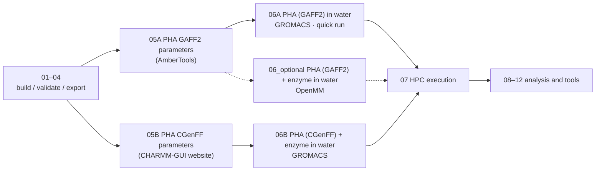

# Tutorial Notebooks

## Design goal

iPHASimulator v2 serves two purposes:

1. **A package** that builds PHA oligomers with RDKit and prepares molecular dynamics (MD) systems from them.
2. **The author's research**: MD of enzyme + PHA systems.

## Where to start

1. Build and export the PHA with **01–04**.
2. **Quick run (PHA in water):** run **05A** first (GAFF2 parameters with AmberTools), then **06A**.
3. **Enzyme systems:** go to **05B** (CGenFF parameters from the CHARMM-GUI website), then **06B**.
4. **06_optional** is another way to build the enzyme system, using OpenMM (needs 05A).
5. Submit long runs with **07**, then analyse with **08–12**.

## System notebooks and their force fields

| Notebook | System | PHA | Protein | Water / ions | Engine |
| --- | --- | --- | --- | --- | --- |
| `06A_gaff2_gromacs_pha_in_water.ipynb` | PHA in water (polymer benchmark method) | GAFF2 (05A) | – | CHARMM-style TIP3P + SOD/CLA | GROMACS |
| `06B_cgenff_gromacs_pha_enzyme_in_water.ipynb` | PHA + enzyme in water (production runs) | CGenFF (05B) | CHARMM36m | CHARMM TIP3P + SOD/CLA | GROMACS |
| `06_optional_gaff2_openmm_pha_enzyme_in_water.ipynb` | PHA + enzyme in water (another way) | GAFF2 (05A) | ff19SB | OPC + Na⁺/Cl⁻ | OpenMM |

06A reproduces the method of the finished polymer-only benchmark (`examples/output/benchmark/`,
notebook 10): the GAFF2 PHA is converted to GROMACS with ParmEd and solvated with the packaged
CHARMM-style water and ion files. Its PHA force field (GAFF2) therefore differs from the enzyme
production runs (06B, CGenFF).

The enzyme–PHA production simulations (GK13/ANC45 × P3HO_4/P3HB_4) used **06B**.
Their input structures were iPHASimulator's R-configured SDF/PDB files (for example
`PHB4_R.sdf`); CGenFF assigned all atom types, charges and parameters, so no GAFF2
charges enter them.

## Run order

Shared build stage:

1. `01_build_pha_oligomer.ipynb`: build PHA oligomers from the built-in monomer definitions.
2. `02_design_custom_pha.ipynb`: select or define a custom PHA target.
3. `03_validate_structures.ipynb`: validate generated oligomers and inspect structures.
4. `04_export_structures.ipynb`: export validated oligomers to SDF/PDB.

Quick run, PHA in water:

5. `05A_amber_gaff2_parameters.ipynb`: PHA GAFF2 parameters with AmberTools (ABCG2 charges by default). **Run this first.**
6. `06A_gaff2_gromacs_pha_in_water.ipynb`: PHA in water, the polymer benchmark method: ParmEd conversion to GROMACS, CHARMM-style TIP3P + SOD/CLA (1.2 nm padding, 0.15 M), and the step6.0–step7 run files.

Enzyme systems:

7. `05B_charmm_cgenff_parameters.ipynb`: PHA CGenFF parameters from the CHARMM-GUI website (Ligand Reader & Modeler), and the Solution Builder handoff.
8. `06B_cgenff_gromacs_pha_enzyme_in_water.ipynb`: prepare and validate a CHARMM-GUI Solution Builder GROMACS package for PHA + enzyme in water, as used for the enzyme–PHA production runs. Without inputs it runs on the example dataset `examples/data/charmm_gui_ANC55_P3HB4/` (ANC55 + P3HB4).

Optional, another way for enzyme systems:

9. `06_optional_gaff2_openmm_pha_enzyme_in_water.ipynb`: PHA (GAFF2, from 05A) + enzyme (ff19SB) in OPC water with OpenMM, starting from the same docked complex PDB as 06B and using the same MD protocol.

Execution and analysis:

10. `07_hpc_execution.ipynb`: HPC execution, SLURM submission, restart continuation, benchmarking and performance tuning; GROMACS (06A, 06B) and OpenMM (06_optional) sections.
11. `08_trajectory_preprocessing.ipynb`: GROMACS trajectory preprocessing: PBC reconstruction, centering with reusable `[ center ]` index groups, compact wrapping, optional fitting and representative frames.
12. `09_solvated_polymer_analysis.ipynb`: Rg, end-to-end distance and SASA of a solvated polymer from the centered trajectory.
13. `10_polymer_benchmark_batch.ipynb`: launcher and progress checker for the six-system polymer-only benchmark (the 06A method, run for six systems).
14. `11_enzyme_docking_setup.ipynb`: prepares PHA oligomer PDB inputs and job notes for manual HADDOCK docking.
15. `12_enzyme_polymer_analysis.ipynb`: stability diagnostics for one enzyme–polymer GROMACS production run (total energy, protein backbone RMSD, polymer RMSD relative to the protein).

The example data in 08/09 (P3HB_4_01) and the six benchmark systems in 10 were
parameterised with GAFF2/AM1-BCC and solvated in GROMACS with CHARMM-style
TIP3P/SOD/CLA.

## Conventions

These tutorials are written for users who may not be computational specialists.
They explain what each step means and keep editable input cells small.

Reusable Python logic belongs in `src/iphasimulator`. Notebook cells should guide
the workflow, not duplicate chemistry or simulation code.
