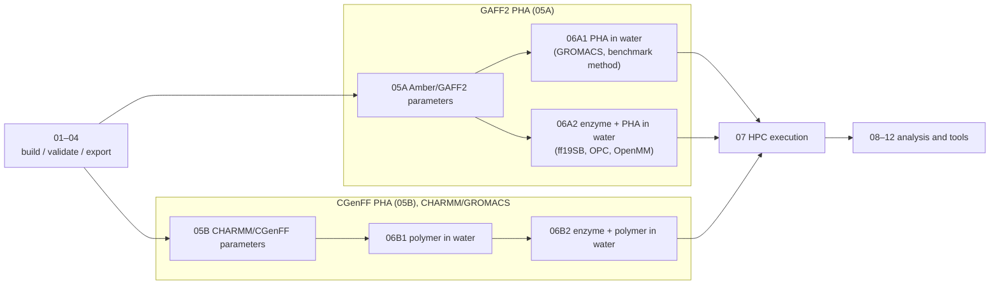

# Tutorial Notebooks

## Design goal

iPHASimulator v2 serves two purposes:

1. **A package** that builds PHA oligomers with RDKit and prepares molecular dynamics (MD) systems from them.
2. **The author's research**: MD of enzyme + PHA systems.

The notebooks follow one shared build stage (01–04), then parameterise the PHA with
GAFF2 (05A) or CGenFF (05B) and build MD systems from those parameters (06).

## System notebooks and their force fields

| Notebook | System | PHA | Protein | Water / ions | Engine |
| --- | --- | --- | --- | --- | --- |
| `06A1_gaff2_gromacs_pha_in_water.ipynb` | PHA in water (polymer benchmark method) | GAFF2 (05A) | – | CHARMM-style TIP3P + SOD/CLA | GROMACS |
| `06A2_amber_openmm_enzyme_polymer_in_water.ipynb` | enzyme + PHA in water | GAFF2 (05A) | ff19SB | OPC + Na⁺/Cl⁻ | OpenMM |
| `06B1_charmm_gromacs_polymer_in_water.ipynb` | PHA in water | CGenFF (05B) | – | CHARMM TIP3P + SOD/CLA | GROMACS |
| `06B2_charmm_gromacs_enzyme_polymer_in_water.ipynb` | enzyme + PHA in water (production runs) | CGenFF (05B) | CHARMM36m | CHARMM TIP3P + SOD/CLA | GROMACS |

06A1 reproduces the method of the finished polymer-only benchmark (`examples/output/benchmark/`,
notebook 10): the GAFF2 PHA is converted to GROMACS with ParmEd and solvated with the packaged
CHARMM-style water and ion files, so its PHA force field (GAFF2) differs from the enzyme
production runs (06B2, CGenFF). HPC submission for all four is in `07_hpc_execution.ipynb`.

The enzyme–PHA production simulations (GK13/ANC45 × P3HO_4/P3HB_4) used the **CHARMM/GROMACS** route.
Their input structures were iPHASimulator's R-configured SDF/PDB files (for example
`PHB4_R.sdf`); CGenFF assigned all atom types, charges and parameters, so no GAFF2
charges enter them.

## Run order

Shared build stage:

1. `01_build_pha_oligomer.ipynb`: build PHA oligomers from the built-in monomer definitions.
2. `02_design_custom_pha.ipynb`: select or define a custom PHA target.
3. `03_validate_structures.ipynb`: validate generated oligomers and inspect structures.
4. `04_export_structures.ipynb`: export validated oligomers to SDF/PDB.

GAFF2 PHA (Amber parameters):

5. `05A_amber_gaff2_parameters.ipynb`: AmberTools GAFF2 parameters (ABCG2 charges by default).
6. `06A1_gaff2_gromacs_pha_in_water.ipynb`: PHA in water, the polymer benchmark method: ParmEd conversion to GROMACS, CHARMM-style TIP3P + SOD/CLA (1.2 nm padding, 0.15 M), and the step6.0–step7 run files.
7. `06A2_amber_openmm_enzyme_polymer_in_water.ipynb`: enzyme + polymer in OPC water from the same docked complex PDB as 06B2 (ff19SB + GAFF2, tleap), with the enzyme-run protocol in OpenMM.

CHARMM/GROMACS:

8. `05B_charmm_cgenff_parameters.ipynb`: CGenFF parameters through CHARMM-GUI Ligand Reader & Modeler and the Solution Builder handoff.
9. `06B1_charmm_gromacs_polymer_in_water.ipynb`: PHA in water with the same steps as 06A1 (box, CHARMM TIP3P + SOD/CLA, run files, benchmark protocol), but with the CGenFF PHA from a Ligand Reader download and CHARMM non-bonded settings.
10. `06B2_charmm_gromacs_enzyme_polymer_in_water.ipynb`: prepare and validate a CHARMM-GUI Solution Builder GROMACS package for enzyme + polymer in water, as used for the enzyme–PHA runs.

Execution and analysis:

11. `07_hpc_execution.ipynb`: HPC execution, SLURM submission, restart continuation, benchmarking and performance tuning; OpenMM and GROMACS sections.
12. `08_trajectory_preprocessing.ipynb`: GROMACS trajectory preprocessing: PBC reconstruction, centering with reusable `[ center ]` index groups, compact wrapping, optional fitting and representative frames.
13. `09_solvated_polymer_analysis.ipynb`: Rg, end-to-end distance and SASA of a solvated polymer from the centered trajectory.
14. `10_polymer_benchmark_batch.ipynb`: launcher and progress checker for the six-system polymer-only benchmark (the 06A1 method, run for six systems).
15. `11_enzyme_docking_setup.ipynb`: prepares PHA oligomer PDB inputs and job notes for manual HADDOCK docking.
16. `12_enzyme_polymer_analysis.ipynb`: stability diagnostics for one enzyme–polymer GROMACS production run (total energy, protein backbone RMSD, polymer RMSD relative to the protein).

The example data in 08/09 (P3HB_4_01) and the six benchmark systems in 10 were
parameterised with GAFF2/AM1-BCC and solvated in GROMACS with CHARMM-style
TIP3P/SOD/CLA.

## Conventions

These tutorials are written for users who may not be computational specialists.
They explain what each step means and keep editable input cells small.

Reusable Python logic belongs in `src/iphasimulator`. Notebook cells should guide
the workflow, not duplicate chemistry or simulation code.
